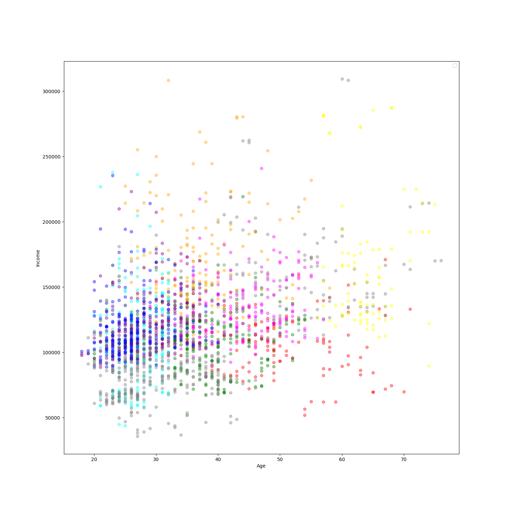

Müşteri Segmentasyonu (K-Prototypes Clustering)
Bu proje, bir müşteri verisetini analiz ederek müşterileri benzer davranış özelliklerine göre gruplandırmayı (segmentasyon) amaçlar.
Makine öğrenmesi dünyasında bu işleme "Unsupervised Learning" (Gözetimsiz Öğrenme) denir.

Proje Özeti
Verisetimizdeki müşterileri; yaş, gelir ve diğer kategorik özelliklerine göre 10 farklı segmente ayırdık.
Bu tür bir çalışma, şirketlerin her müşteri grubuna özel pazarlama stratejileri geliştirmesine yardımcı olur.

Veri Hazırlama ve İşleme
Veri Temizleme: Eksik veriler (null) kontrol edildi ve veri bütünlüğü sağlandı.

Normalizasyon: Gelir ve Yaş gibi farklı ölçeklerdeki veriler, algoritmanın daha sağlıklı çalışması için MinMaxScaler ile 0-1 arasına çekildi.

Özellik Seçimi: Kümeleme işlemine dahil edilmeyecek olan ID sütunu veri setinden çıkarıldı.

Model: K-Prototypes
Neden K-Means yerine K-Prototypes kullandık?

K-Means: Sadece sayısal verilerle (gelir, yaş) çalışabilir.

K-Modes: Sadece kategorik verilerle (meslek, eğitim) çalışabilir.

K-Prototypes: Her iki veri tipini de harmanlayarak gerçek dünya verilerine en uygun sonucu verir.

Görselleştirme
Kümeleme işlemi bittikten sonra, müşterilerin Gelir ve Yaş dağılımları farklı renklerle görselleştirilmiştir.
Bu sayede her bir kümenin (cluster) hangi yaş ve gelir grubuna hitap ettiği net bir şekilde gözlemlenebilmektedir.

Daha Fazla Görselleştirme: Sadece yaş ve gelir değil, eğitim seviyesine göre de dağılım incelenebilir.

Segmentasyon Sonuçlarının Analizi
Yukarıdaki grafik, müşterilerin Yaş (Age) ve Yıllık Gelir (Income) bazındaki dağılımlarını, modelimiz tarafından atanan 10 farklı küme (segment) bazında göstermektedir.

Grafikten Çıkarılan Temel Gözlemler:

Genç ve Dinamik Segmentler (Sol Bölüm): Yaşı 20-30 arasında olan ve gelir düzeyi genellikle 50.000 ile 150.000 arasında yoğunlaşan geniş bir müşteri grubu görülmektedir (Mavi, mor ve turkuaz noktalar).

Yüksek Gelirli Niş Gruplar (Üst Bölüm): Yaştan bağımsız olarak, geliri 250.000'in üzerine çıkan az sayıda ama değerli bir grup bulunmaktadır (Turuncu ve sarı noktalar).

Olgun ve İstikrarlı Segment (Sağ Bölüm): 50 yaş ve üzeri, orta-yüksek gelir düzeyine sahip müşteriler daha seyrek ama belirgin bir kümelenme sergilemektedir (Sarı ve gri noktalar).

Alt Gelir Grubu (Alt Bölüm): Her yaş grubundan, geliri 50.000 civarında olan müşteriler model tarafından ayrı karakteristik özelliklerine göre (muhtemelen medeni durum veya eğitim gibi kategorik veriler etkisiyle) farklı renklerle sınıflandırılmıştır.
